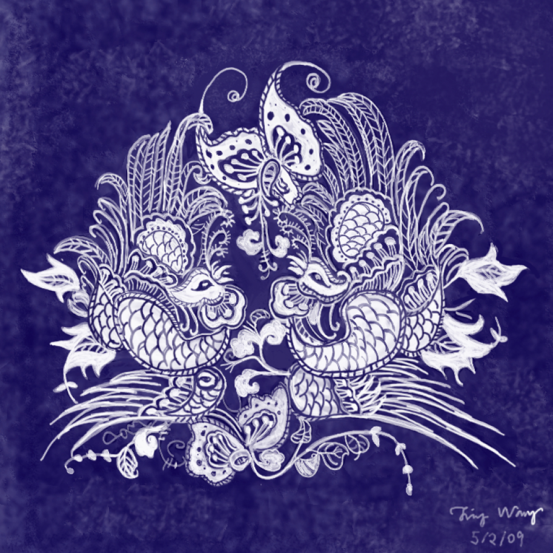

# Random art and design projects

	
	   <canvas data-processing-sources="random_process.pde"></canvas>
	 
  art with <a href="https://processing.org/tutorials/overview/" > Processing </a> 

<h2> Drawings </h2>

      

<h2> Graphic design,Book Cover, Poster, &Post Cards </h2>

  
  
  

  

  

  

<h2> Time elapse </h2>

 

